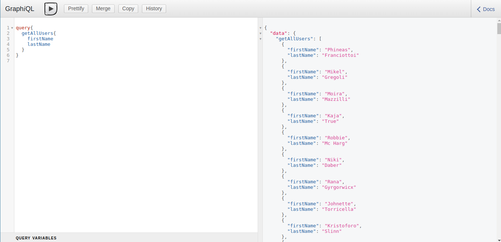
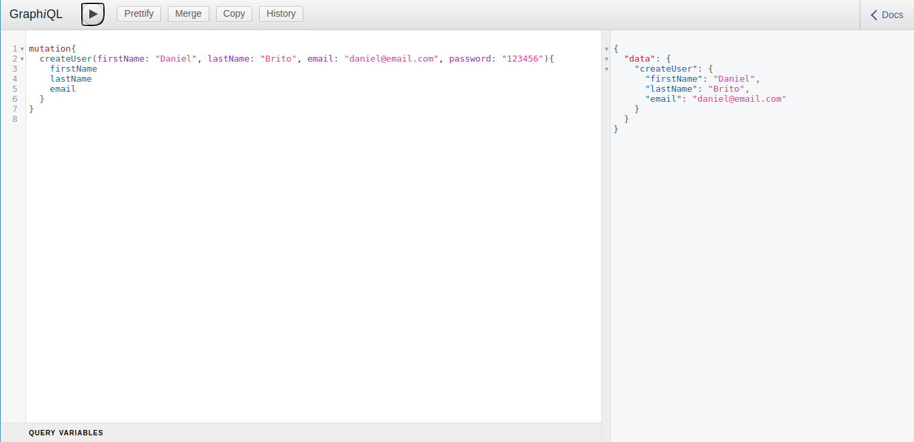

# Tutorial: GraphQL & Apollo Client

## Stack

FrontEnd:

- React
- Apollo Client
- GraphQL

BackEnd:

- NodeJS
- ExpressJS
- GraphQL
- Express-GraphQL

## Resources

- [Mockaroo](https://www.mockaroo.com/)

## GraphiQL Previews

### Query

### Mutation

### Form & List

